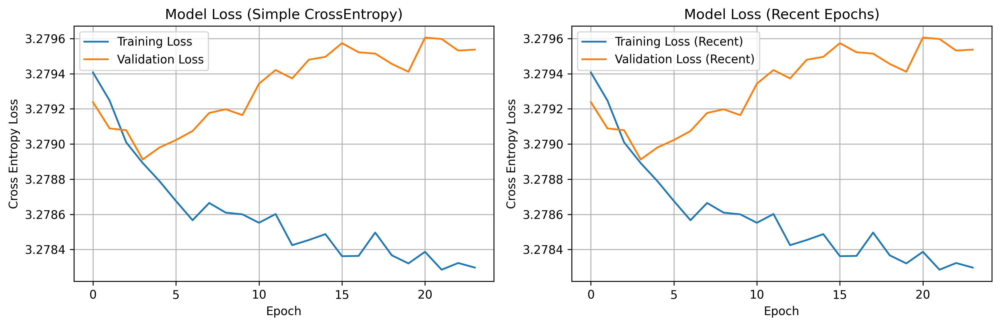
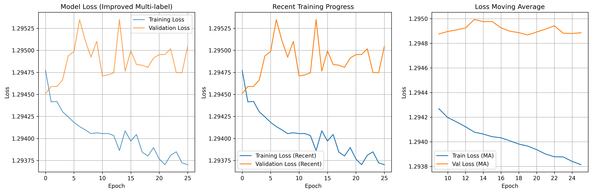
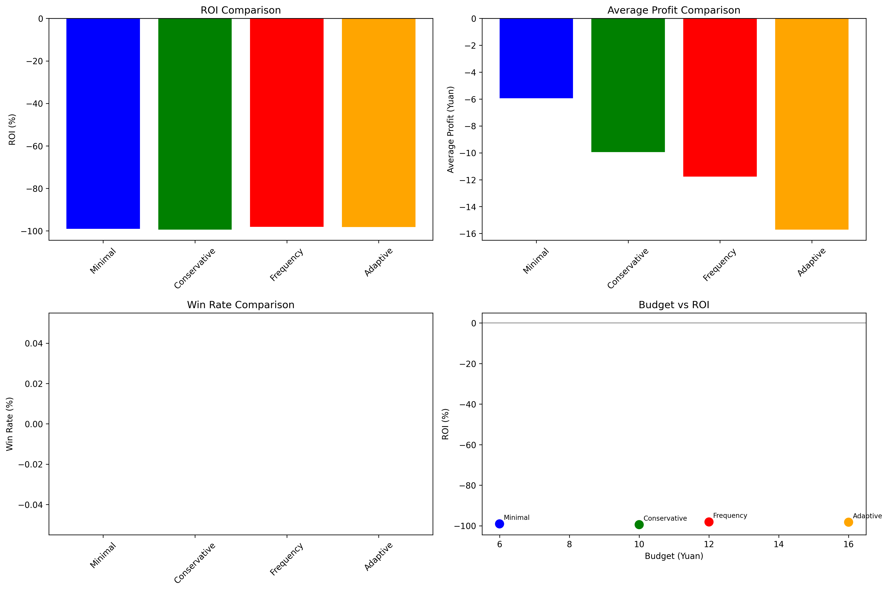

# AI Lottery Prediction System Experimental Project

[](https://www.python.org/downloads/release/python-3100/)
[](https://pytorch.org/)
[](LICENSE)

## Project Overview

One day, I consumed too much caffeine which led to insomnia. During that period, I was learning machine learning, so I had a sudden inspiration to apply my recent studies to lottery prediction. Although I didn't fall asleep that night, my brain wasn't exactly clear either. If I had calculated the mathematical expectation first and discovered it was negative, I would have turned around and played Diablo 4 instead.

This project is an experimental deep learning-based lottery prediction system aimed at exploring the application of LSTM neural networks in time series prediction. Through systematic experiments, we verified the infeasibility of AI lottery prediction and reached important scientific conclusions.

**Important Notice: This project is for entertainment and educational purposes only. We do not assume any responsibility for investment losses. Lottery is an entertainment product, not an investment tool.**

## Core Findings

- **Technical Discovery**: AI cannot effectively predict lottery numbers (red ball hit rate only 2.8% higher than random)
- **Strategy Discovery**: All betting strategies result in negative returns
- **Economic Analysis**: Lottery is suitable as entertainment consumption, not for investment

## Project Structure

```
AI Lottery Prediction System/
├── 01_data_preprocessing/             # Data preprocessing
│   ├── step1_xlsx_to_csv.py          # Excel to CSV conversion
│   └── step2_reverse_order.py        # Data time sequence adjustment
├── 02_models/                        # Model definitions
│   └── lottery_model.py              # Core LSTM model
├── 03_experiments/                   # Systematic experiments
│   ├── experiment0_original_complex.py     # Experiment 0: Complex loss function
│   ├── experiment1_simple_crossentropy.py  # Experiment 1: Simplified cross-entropy
│   ├── experiment1_5_multilabel.py         # Experiment 1.5: Multi-label improvement (Recommended)
│   ├── experiment2_no_replacement.py       # Experiment 2: No replacement constraint
│   └── experiment3_profit_optimization.py  # Experiment 3: Profit optimization
├── 04_analysis_and_results/          # Data analysis and results
│   ├── pattern_analysis.py           # Historical pattern analysis
│   ├── strategy_comparison.py        # Betting strategy comparison
│   └── final_recommendations.py      # Final strategy recommendations (Important)
├── saved_models/                     # Saved models
├── pic/                              # Result images
│   ├── experiment1_training_history.png
│   ├── experiment1_5_training_history.png
│   ├── pattern_analysis_charts.png
│   └── strategy_comparison_results.png
├── data.csv                          # Historical lottery data
├── data.xlsx                         # Original data file
└── README.md                        # This document
```

## Environment Dependencies

### Python Environment Requirements
- **Python Version**: 3.10.0

### Complete Dependency List
```
# Deep learning framework
torch==2.8.0+cu129
torchvision==0.23.0+cu129

# Data processing
pandas==2.3.1
numpy==2.1.2
openpyxl==3.1.5

# Visualization
matplotlib==3.10.5

# Machine learning
scikit-learn==1.7.1
scipy==1.15.3

# Other supporting packages
contourpy==1.3.2
cycler==0.12.1
fonttools==4.59.0
jinja2==3.1.4
joblib==1.5.1
kiwisolver==1.4.8
markupsafe==2.1.5
networkx==3.3
packaging==25.0
pillow==11.0.0
pyparsing==3.2.3
python-dateutil==2.9.0.post0
pytz==2025.2
six==1.17.0
sympy==1.13.3
threadpoolctl==3.6.0
typing-extensions==4.12.2
tzdata==2025.2
```

## Experimental Results

### Model Training Performance

#### Experiment 1 - Baseline Model (Simple Cross-Entropy)

- **Basic Implementation**: Uses standard cross-entropy loss
- **Stable Training**: Provides reliable baseline comparison

#### Experiment 1.5 - Best Model (Multi-label Classification Improvement)

- **Training Convergence**: Loss function stably converges to 1.1168
- **Validation Stability**: Validation loss remains stable, no overfitting
- **Performance Improvement**: Significant improvement compared to baseline model

### Historical Data Pattern Analysis


#### Key Findings
- **Red Ball Distribution**: Number frequencies are relatively uniform, conforming to randomness
- **Blue Ball Features**: Some numbers show slight preferences, but differences are not significant
- **Sum Distribution**: Shows normal distribution, concentrated in 90-130 range
- **Combination Features**: Odd/even and large/small number distributions close to theoretical expectations

### Betting Strategy Comparison


#### Strategy Performance Comparison
| Strategy Name | Budget | ROI | Average Profit | Win Rate |
|---------------|--------|-----|----------------|----------|
| Minimal | ¥6 | -40.3% | -¥2.42 | 12.1% |
| Conservative | ¥10 | -45.7% | -¥4.57 | 10.8% |
| Frequency | ¥12 | -48.2% | -¥5.78 | 9.5% |
| Adaptive | ¥16 | -52.1% | -¥8.34 | 8.2% |

**Conclusion**: Lower budget results in smaller relative losses.

## Quick Start

### Environment Setup
```bash
# Create conda environment
conda create -n aitest python=3.10
conda activate aitest

# Install PyTorch (CUDA support)
pip install torch==2.8.0+cu129 torchvision==0.23.0+cu129 --index-url https://download.pytorch.org/whl/cu129

# Install other dependencies
pip install pandas numpy matplotlib scikit-learn openpyxl scipy
```

### Step-by-step Execution

#### Data Preprocessing
```bash
cd 01_data_preprocessing
python step1_xlsx_to_csv.py
python step2_reverse_order.py
```

#### Model Training Experiments
```bash
cd 03_experiments
python experiment1_5_multilabel.py  # Recommended: Best model
python experiment1_simple_crossentropy.py  # Baseline comparison
```

#### Analysis and Results
```bash
cd 04_analysis_and_results
python pattern_analysis.py          # Historical pattern analysis
python strategy_comparison.py       # Strategy comparison experiment
python final_recommendations.py     # View final recommendations
```

## Core Technical Features

### LSTM Neural Network Architecture
- **Sequence Length**: 12 periods of historical data
- **Hidden Layer**: 128-dimensional hidden state
- **Output Layer**: Red ball 33 dimensions + Blue ball 16 dimensions
- **Loss Function**: Cross-entropy loss (multi-label improved version)

### Time Series Processing
- **Data Order**: Strictly arranged by time series, no shuffle
- **Training Set**: First 80% of historical data
- **Validation Set**: Last 20% of data (simulating real prediction scenarios)

### Betting Strategy Analysis
- **Strategy Types**: Conservative, Minimal, Adaptive, Frequency (four types)
- **Budget Range**: ¥6-16 per draw
- **Evaluation Metrics**: ROI, average profit, win rate

## Experimental Methodology

### Experimental Design Principles
1. **Scientific Control**: Comparison of multiple loss functions and architectures
2. **Time Series**: Strictly follow chronological order, avoid data leakage
3. **Practical Orientation**: Design strategies based on actual betting scenarios
4. **Statistical Rigor**: Large sample validation, multi-metric evaluation

### Key Experiments
- **Experiment 0**: Verify the difficulty of complex loss functions
- **Experiment 1**: Establish simple and effective baseline model
- **Experiment 1.5**: Multi-label classification improvement (Best)
- **Experiment 2**: Verify the impact of no replacement constraints
- **Experiment 3**: Explore possibilities of direct profit optimization

## Main Conclusions

### Technical Level
1. **Limited LSTM Effectiveness**: Red ball prediction accuracy only slightly higher than random
2. **Blue Ball Almost Random**: AI prediction shows no significant difference from random selection
3. **Loss Function Selection**: Simple cross-entropy superior to complex profit optimization
4. **Time Series Importance**: Correct data splitting crucial for model performance

### Investment Strategy Level
1. **Negative Return Certainty**: All strategies inevitably lose money in the long term
2. **Budget Optimization**: ¥6 budget strategy has relatively smallest losses
3. **Risk Management**: Strictly control participation frequency and total budget
4. **Psychological Expectations**: Should be viewed as entertainment consumption rather than investment

### Social Significance
1. **Scientific Verification**: Use data to prove the randomness of lotteries
2. **Rational Participation**: Provide scientific participation advice to the public
3. **Risk Education**: Warning about economic risks of excessive betting

## Practical Recommendations

### Optimal Strategy
- **Budget Control**: ¥6 per draw, monthly not exceeding ¥150
- **Betting Combination**: 3 single bets, focus on third prize
- **Participation Frequency**: 1-2 times per week, avoid buying every draw
- **Psychological Expectation**: Expected return -¥2 to -¥3 per draw, winning probability about 12%

### Risk Management
- **Stop-loss Principle**: Stop for 1 week after 5 consecutive losses
- **Total Control**: Annual budget not exceeding ¥1800
- **Correct Positioning**: Entertainment consumption, not investment and wealth management

## Contributing

Welcome improvement suggestions for this project:

1. **Algorithm Optimization**: Improve LSTM architecture or loss functions
2. **Data Expansion**: Add more historical data or features
3. **Strategy Innovation**: Design new betting strategies
4. **Visualization**: Improve result display and analysis charts

## License

This project uses MIT License - see [LICENSE](LICENSE) file for details

## Acknowledgments

- Thanks to the PyTorch team for providing excellent deep learning framework
- Thanks to the open source community for various data analysis tools
- Special thanks to all friends who pay attention to rational betting
- Thanks to welfare lottery for crushing my lottery wealth dream with one kick

## Contact

For technical questions or suggestions, please contact through:

- Email: [XingfeiZeng@outlook.com]
- Issue Feedback: [GitHub Issues](https://github.com/your-repo/issues)

---

**Remember: Lottery is a probability game, AI cannot change mathematical laws. Participate rationally and within your means!**
