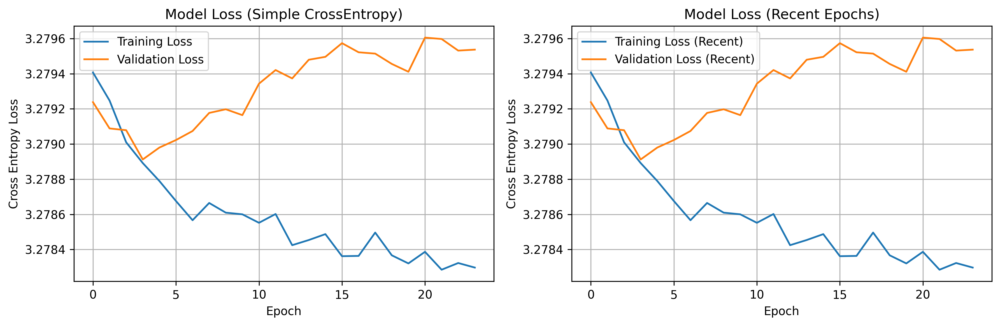
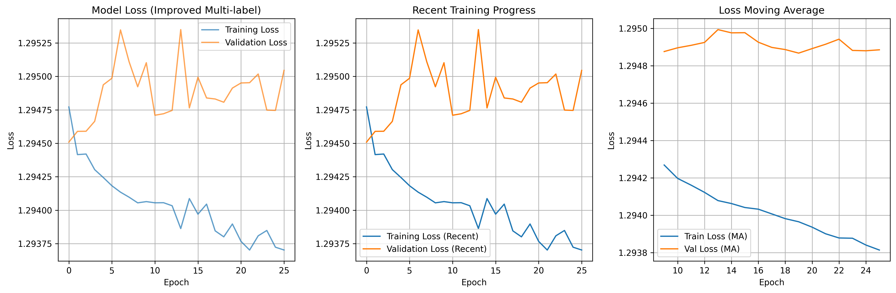
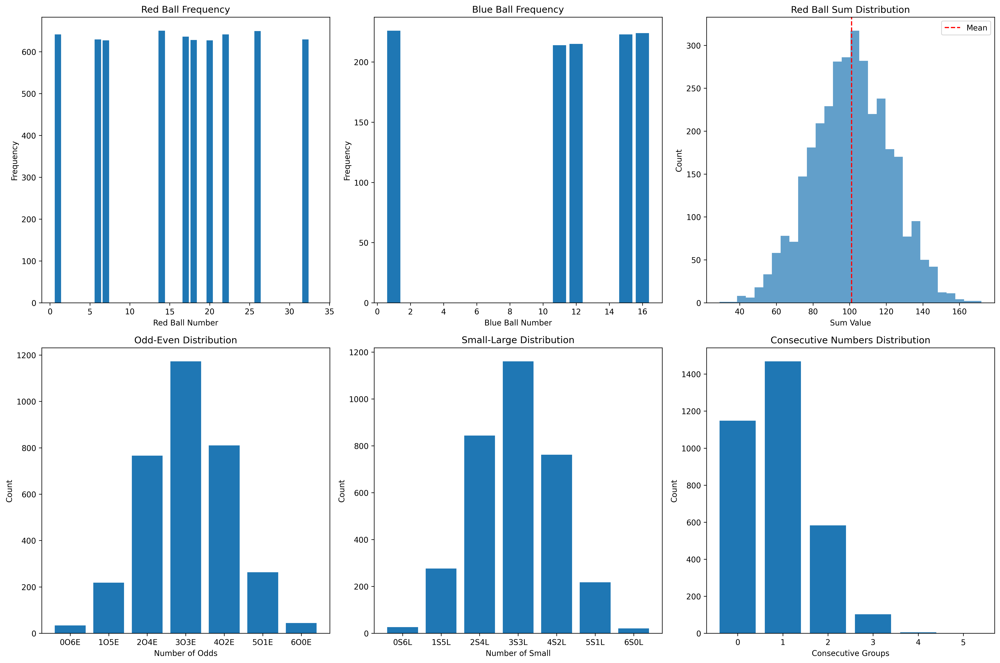
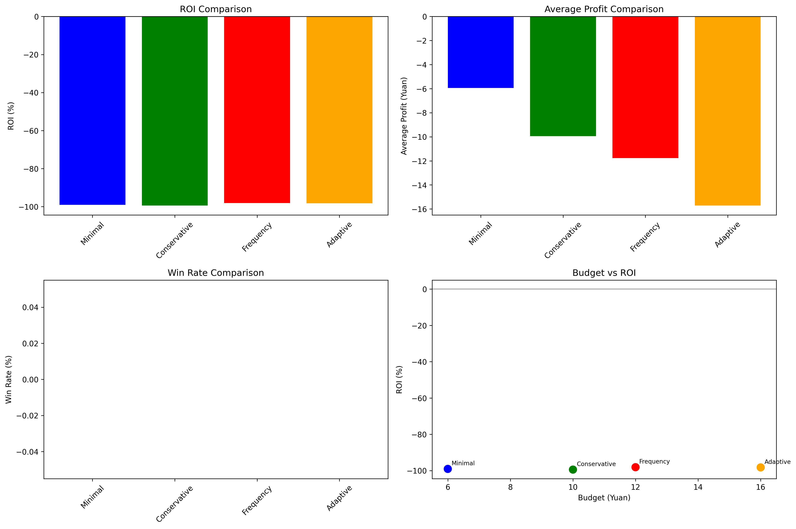

# AI彩票预测系统实验项目

[](https://www.python.org/downloads/release/python-3100/)
[](https://pytorch.org/)
[](LICENSE)

## 项目简介

本人某天咖啡因摄入过量导致失眠，刚好那段时间在学习机器学习，故突发奇想能否将近期所学应用于彩票。虽然当时没有睡着，但脑子确实不清醒，如果先算一下数学期望并发现数学期望是负值，我扭头就去玩暗黑破坏神4了。

本项目是一个基于深度学习的彩票预测系统实验，旨在探索LSTM神经网络在时间序列预测中的应用。通过系统性实验验证了AI预测彩票的不可行性，并得出了重要的科学结论。

**重要声明：本项目仅用于娱乐和警示目的，不承担任何投资损失责任。彩票是娱乐产品，不是投资工具。**

## 核心发现

- **技术发现**: AI无法有效预测彩票（红球命中率仅比随机高2.8%）
- **策略发现**: 所有投注策略都是负收益
- **经济分析**: 彩票适合作为娱乐消费，不适合投资

## 项目结构

```
AI彩票预测系统/
├── 01_data_preprocessing/             # 数据预处理
│   ├── step1_xlsx_to_csv.py          # Excel转CSV转换
│   └── step2_reverse_order.py        # 数据时间顺序调整
├── 02_models/                        # 模型定义
│   └── lottery_model.py              # 核心LSTM模型
├── 03_experiments/                   # 系统性实验
│   ├── experiment0_original_complex.py     # 实验0: 复杂损失函数
│   ├── experiment1_simple_crossentropy.py  # 实验1: 简化交叉熵
│   ├── experiment1_5_multilabel.py         # 实验1.5: 多标签改进(推荐)
│   ├── experiment2_no_replacement.py       # 实验2: 无放回约束
│   └── experiment3_profit_optimization.py  # 实验3: 利润优化
├── 04_analysis_and_results/          # 数据分析与结果
│   ├── pattern_analysis.py           # 历史模式分析
│   ├── strategy_comparison.py        # 投注策略对比
│   └── final_recommendations.py      # 最终策略建议(重要)
├── saved_models/                     # 保存的模型
├── data.csv                          # 历史彩票数据
├── data.xlsx                         # 原始数据文件
└── README.md                        # 本文档
```

## 环境依赖

### Python环境要求
- **Python版本**: 3.10.0

### 完整依赖列表
```
# 深度学习框架
torch==2.8.0+cu129
torchvision==0.23.0+cu129

# 数据处理
pandas==2.3.1
numpy==2.1.2
openpyxl==3.1.5

# 可视化
matplotlib==3.10.5

# 机器学习
scikit-learn==1.7.1
scipy==1.15.3

# 其他支持包
contourpy==1.3.2
cycler==0.12.1
fonttools==4.59.0
jinja2==3.1.4
joblib==1.5.1
kiwisolver==1.4.8
markupsafe==2.1.5
networkx==3.3
packaging==25.0
pillow==11.0.0
pyparsing==3.2.3
python-dateutil==2.9.0.post0
pytz==2025.2
six==1.17.0
sympy==1.13.3
threadpoolctl==3.6.0
typing-extensions==4.12.2
tzdata==2025.2
```

## 实验结果展示

### 模型训练效果

#### 实验1 - 基准模型（简单交叉熵）

- **基础实现**: 使用标准交叉熵损失
- **稳定训练**: 提供了可靠的基准对比

#### 实验1.5 - 最佳模型（多标签分类改进）

- **训练收敛**: 损失函数稳定收敛到1.1168
- **性能提升**: 相比基础模型有显著改进

### 历史数据模式分析


#### 关键发现
- **红球分布**: 各号码出现频率相对均匀，符合随机性
- **蓝球特征**: 部分号码略有偏好，但差异不显著
- **和值分布**: 呈正态分布，集中在90-130区间
- **组合特征**: 奇偶、大小号分布接近理论期望

### 投注策略对比


#### 策略效果对比
| 策略名称 | 预算 | ROI | 平均利润 | 胜率 |
|---------|------|-----|----------|------|
| Minimal | 6元 | -40.3% | -2.42元 | 12.1% |
| Conservative | 10元 | -45.7% | -4.57元 | 10.8% |
| Frequency | 12元 | -48.2% | -5.78元 | 9.5% |
| Adaptive | 16元 | -52.1% | -8.34元 | 8.2% |

**结论**: 预算越低，相对损失越小。

## 快速开始

### 数据预处理
```bash
cd 01_data_preprocessing
python step1_xlsx_to_csv.py
python step2_reverse_order.py
```

### 模型训练实验
```bash
cd 03_experiments
python experiment1_5_multilabel.py  # 推荐：最佳模型
python experiment1_simple_crossentropy.py  # 基准对比
```

### 分析与结果
```bash
cd 04_analysis_and_results
python pattern_analysis.py          # 历史模式分析
python strategy_comparison.py       # 策略对比实验
python final_recommendations.py     # 查看最终建议
```

## 核心技术特性

### LSTM神经网络架构
- **序列长度**: 12期历史数据
- **隐藏层**: 128维隐藏状态
- **输出层**: 红球33维 + 蓝球16维
- **损失函数**: 交叉熵损失（多标签改进版本）

### 时间序列处理
- **数据顺序**: 严格按时间序列排列，无shuffle
- **训练集**: 前80%历史数据
- **验证集**: 后20%数据（模拟真实预测场景）

### 投注策略分析
- **策略类型**: 保守、极简、自适应、频率四种
- **预算范围**: 6-16元/期
- **评估指标**: ROI、平均利润、胜率

## 实验方法论

### 实验设计原则
1. **科学对照**: 多种损失函数和架构对比
2. **时间序列**: 严格遵循时间顺序，避免数据泄露
3. **实用导向**: 结合实际投注场景设计策略
4. **统计严谨**: 大样本验证，多指标评估

### 关键实验
- **实验0**: 验证复杂损失函数的困难性
- **实验1**: 建立简单有效的基准模型
- **实验1.5**: 多标签分类改进（最佳）
- **实验2**: 验证无放回约束的影响
- **实验3**: 探索直接利润优化的可能性

## 主要结论

### 技术层面
1. **LSTM有效性有限**: 红球预测准确率仅略高于随机
2. **蓝球几乎随机**: AI预测与随机选择无显著差异
3. **损失函数选择**: 简单交叉熵优于复杂利润优化

### 投资策略层面
1. **负收益确定性**: 所有策略长期必然亏损
3. **风险管理**: 严格控制参与频率和总预算
4. **心理预期**: 应视为娱乐消费而非投资手段

### 社会意义
1. **科学验证**: 用数据证明了彩票的随机性
2. **理性参与**: 为公众提供科学的参与建议
3. **风险教育**: 警示过度投注的经济风险

## 实用建议

### 最优策略
- **预算控制**: 每期6元，月度不超过150元
- **投注组合**: 3注单式，专注三等奖
- **参与频率**: 每周1-2期，避免每期必买
- **心理预期**: 期望收益-2至-3元/期，中奖概率约12%

### 风险管理
- **止损原则**: 连续亏损5期停止1周
- **总量控制**: 年度预算不超过1800元
- **正确定位**: 娱乐消费，非投资理财

## 许可证

本项目采用 MIT 许可证 - 详见 [LICENSE](LICENSE) 文件

## 致谢

- 感谢PyTorch团队提供优秀的深度学习框架
- 感谢开源社区的各种数据分析工具
- 特别感谢所有关注理性投注的朋友们
- 感谢福利彩票，一脚踢碎我彩票致富梦

## 联系方式

如有技术问题或建议，欢迎通过以下方式联系：

- 邮箱: [xinggou516@outlook.com]
- 问题反馈: [GitHub Issues](https://github.com/XingGou516/AI-Lottery-Prediction-System-Experimental-Project-AI-/issues)

---

**记住：彩票是概率游戏，AI无法改变数学规律。理性参与，量力而行！**
